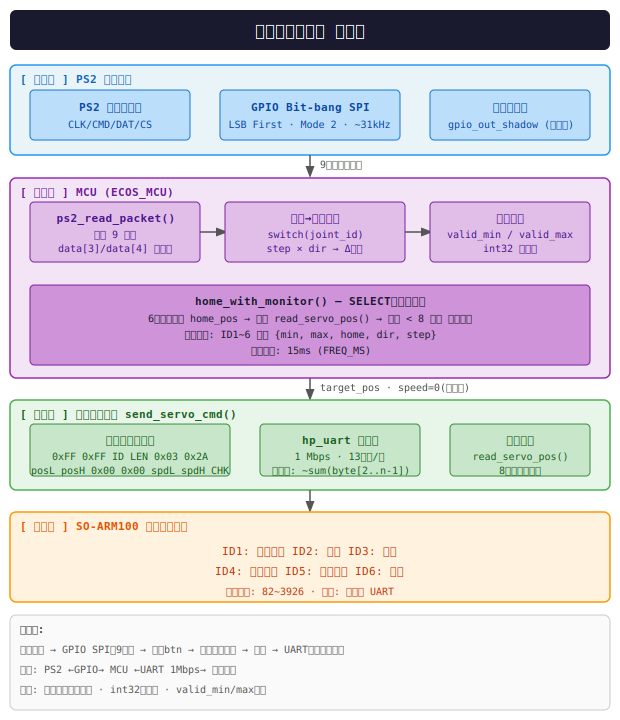
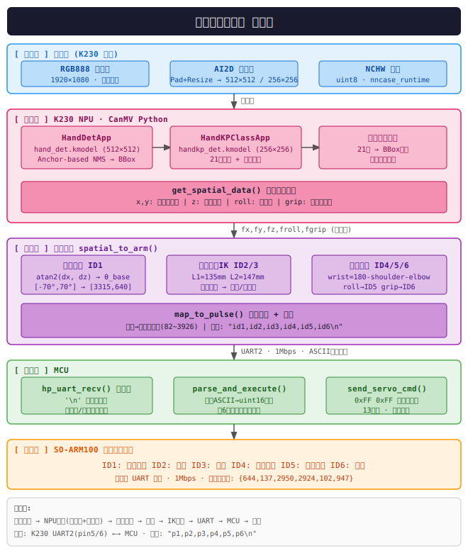

# SO-101 Robot

6-DOF robotic arm system based on RISC-V MCU and STS3215 servos, supporting dual control modes: **PS2 gamepad** and **Taishan Pi vision**.

## System Architecture





## Directory Structure

```
mcu/             RISC-V firmware (gamepad control)
taishan/         Taishan Pi vision control (Python)
tools/           Debug utilities (servo test)
hardware/easyeda/ JLC EasyEDA project files
Architecture/    System architecture diagrams
```

## Hardware

| Component | Description |
| --------- | ---------- |
| **MCU** | StarSky C2 (RISC-V RV32IM) |
| **Servos** | 6× STS3215 (TTL half-duplex UART, 1 Mbps) |
| **Controller** | PS2 gamepad (custom IP core @ `0x20005000`) |
| **Vision SoC** | Canaan K230 (Taishan Pi) |

### Servo Calibration (6-DOF Arm)

| ID | Joint | Min Pulse | Max Pulse | Home | Direction |
| --- | ---- | --------- | --------- | ---- | --------- |
| 1 | Base (L/R) | 640 | 3315 | 644 | +1 |
| 2 | L1/L2 | 136 | 2511 | 137 | +1 |
| 3 | R1/R2 | 716 | 2950 | 2950 | -1 |
| 4 | Up/Down | 900 | 2924 | 2924 | -1 |
| 5 | Triangle/X | 82 | 3926 | 102 | -1 |
| 6 | Square/Circle | 926 | 2356 | 947 | +1 |

## Controls (PS2 Gamepad)

| Button | Action |
| ------ | ------ |
| D-Pad Left/Right | Joint 1 (Base rotation) |
| D-Pad Up/Down | Joint 4 (Vertical) |
| L1 / L2 | Joint 2 |
| R1 / R2 | Joint 3 |
| Triangle / X | Joint 5 |
| Square / Circle | Joint 6 |
| SELECT | Home all servos |

## Build (MCU Firmware)

**Prerequisites:** RISC-V GNU toolchain (`riscv64-unknown-elf-`), ECOS SDK

```bash
cd mcu/SO-101_Robot
make menuconfig   # Configure hardware options
make              # Build firmware
```

Output files in `build/`:
- `retrosoc_fw` — ELF executable
- `retrosoc_fw.hex` — Verilog hex (for FPGA bitstream)
- `retrosoc_fw.bin` — Raw binary

## Servo Debug Tool

Linux host utility for direct servo testing via USB-UART:

```bash
cd tools/servo_test/sts3215_test
make
./servo_debug
# Menu: 1=Home  2=Angle control  5=Status  6=Raw pulse
```

## Control Modes

| Mode | Branch | Input | Status |
| ---- | ------ | ----- | ------ |
| Gamepad | `main` | PS2 controller → MCU | Active |
| Vision | (planned) | Taishan Pi → MCU | In development |

## License

Apache License 2.0 — see [LICENSE](LICENSE)

Copyright 2025 ECOS Team
